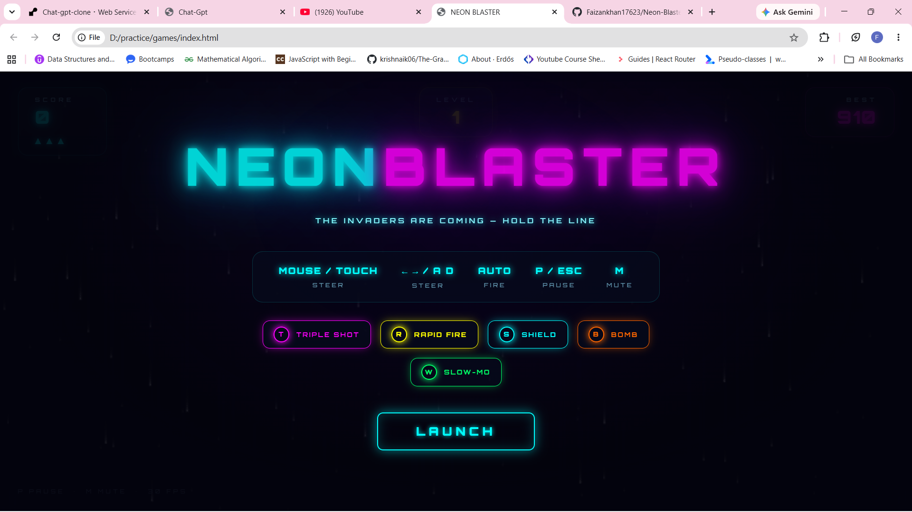
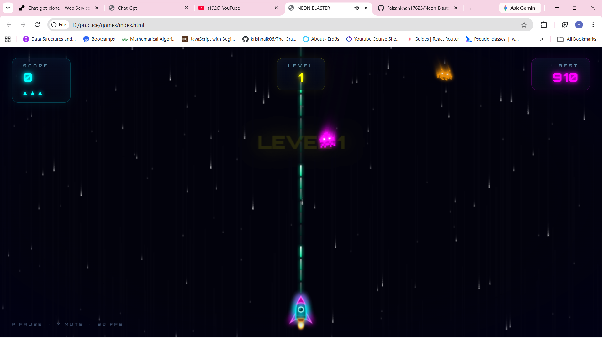

# 🚀 Neon Blaster

A flashy neon arcade space shooter that runs entirely in the browser — **one HTML file, zero dependencies, no build step**. Double-click `index.html` and play.

  

## 📸 Screenshots

| Start Screen | Gameplay |
|---|---|
|  |  |

## 🎮 How to Play

| Action | Control |
|---|---|
| Move ship | Mouse / Touch / `←` `→` / `A` `D` |
| Shoot | Automatic |
| Pause | `P` or `Esc` |
| Mute | `M` |
| Start / Restart | Click button or `Space` |

Destroy enemies before they reach the bottom or touch you. Every enemy that slips past — or hits you — costs a life. You have **3 lives**. Survive as long as you can; it only gets faster.

## ✨ Features

### Gameplay
- **Combo system** — chain kills within 2 seconds to climb from x1 to **x10** multiplier (points = base × combo)
- **4 enemy types** — normal polygons, zigzag weavers, splitters (break into two on death), and armored tanks (3 hits)
- **Boss fights** — the **DREADNOUGHT** appears every 5 levels: a huge rotating hexagon with an HP bar that strafes the screen and fires aimed shots at you
- **5 power-ups** dropped by destroyed enemies:
  - 🟣 **T — Triple Shot**: 3-way spread fire
  - 🟡 **R — Rapid Fire**: more than doubles your fire rate
  - 🔵 **S — Shield**: absorbs one hit
  - 🟠 **B — Bomb**: wipes every enemy on screen (and chunks the boss)
  - 🟢 **W — Slow-Mo**: slows all enemies to a crawl
- **Level system** with on-screen announcements and a steady difficulty ramp (spawn rate, enemy speed, boss HP all scale)
- **Lives + invincibility frames** — getting hit grants brief blinking invulnerability
- **Best score** persisted in `localStorage`

### Visuals & Audio
- **Neon glow** on everything via Canvas `shadowBlur`
- **Particle explosions** — every kill bursts into dozens of glowing sparks
- **Screen shake** scaled to the size of the explosion
- **Motion trails** — the frame fades instead of clearing, so everything leaves light streaks
- **3-layer parallax starfield** for depth
- **Floating score popups**, combo drain bar, power-up timers, boss HP bar
- **CRT-style scanlines + vignette** overlay
- **Fully synthesized sound effects** with the Web Audio API — lasers, explosions, power-up chimes, boss alarms. No audio files.

## 🛠️ Tech Stack

| Part | Tech |
|---|---|
| Structure | Single `index.html` |
| Rendering | HTML5 Canvas 2D |
| UI / HUD | CSS (neon text-shadows, overlay screens) |
| Logic | Vanilla JavaScript — `requestAnimationFrame` loop, delta-time movement, circle collision |
| Audio | Web Audio API (oscillators + noise buffers, all synthesized) |
| Storage | `localStorage` for best score |

No frameworks. No npm. No server. No assets.

## 🚀 Run It

```bash
git clone https://github.com/Faizankhan17623/Neon-Blaster.git
cd Neon-Blaster
# then just open index.html in any modern browser
```

Or play it instantly by enabling **GitHub Pages** (Settings → Pages → deploy from `main` branch root).

## 🗺️ Roadmap

- [ ] Node.js + MongoDB online leaderboard
- [ ] More boss patterns
- [ ] Gamepad support
- [ ] Mobile fire-button layout

## 📄 License

MIT — do whatever you want with it.
